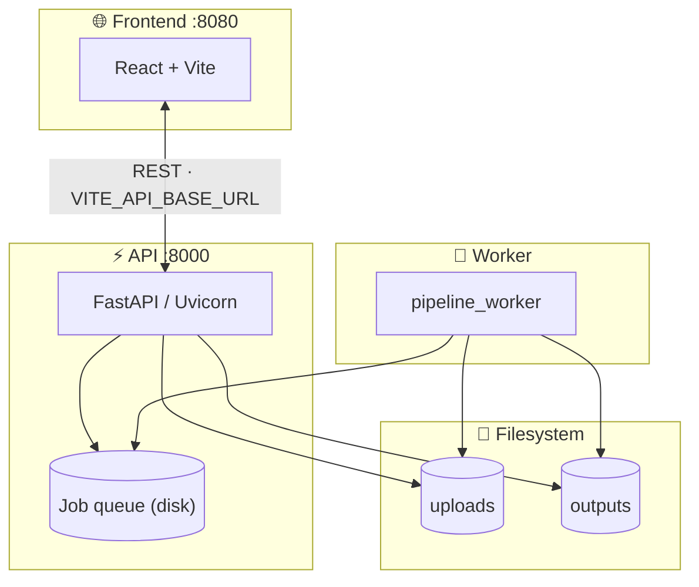
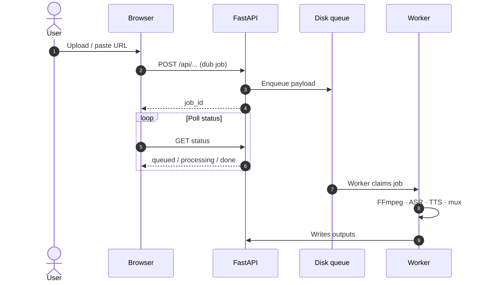

<div align="center">

<!-- Hero: vector banner (no external JS) -->


<br/><br/>

<!-- Skill icons (official skillicons.dev) -->
<a href="https://skillicons.dev"></a>

<br/><br/>

<!-- Primary actions -->
<p>
  <a href="https://github.com/Ranuka-Jayesh/voxinity/issues"></a>
  <a href="https://github.com/Ranuka-Jayesh/voxinity.git"></a>
  <a href="./LICENSE"></a>
  <a href="#quick-start"></a>
</p>

<!-- Stack & stats -->
<p>
  <a href="https://vitejs.dev/"></a>
  <a href="https://react.dev/"></a>
  <a href="https://fastapi.tiangolo.com/"></a>
  <a href="https://www.python.org/"></a>
</p>
<p>
  <a href="https://github.com/Ranuka-Jayesh/voxinity/stargazers"></a>
  <a href="https://github.com/Ranuka-Jayesh/voxinity/network/members"></a>
  
</p>

</div>

> [!TIP]
> **Browse interactively:** use the ▶ sections below to expand only what you need. Diagrams use **Mermaid** (native on GitHub).

> [!NOTE]
> **Ports:** UI <kbd>8080</kbd> · API <kbd>8000</kbd> · Set `VITE_API_BASE_URL` on Vercel and `CORS_ORIGINS` on the API for production.

<br/>

---

<details open>
<summary><b>📑 Table of contents</b> — click to collapse</summary>

| | |
|:--|:--|
| [At a glance](#at-a-glance) | One-screen overview |
| [Architecture](#architecture) | Flow + sequence diagrams |
| [Quick start](#quick-start) | Checklist + install + 3 terminals |
| [Environment](#environment) | Env vars cheat sheet |
| [Deploy](#deploy) | Docker · Vercel · CORS (nested steps) |
| [Scripts](#scripts) | `npm` reference |
| [GitHub About](#github-about) | Repo card text |
| [License](#license) | MIT |

</details>

---

<a id="at-a-glance"></a>
## ✨ At a glance

| | **What** | **Why it matters** |
|:--:|--|--|
| 🎬 | **Dubbing pipeline** | Upload or URL → transcribe → translate → TTS → mux — with optional sign-language path. |
| 🖥️ | **React + Vite** | SPA on **:8080**, shadcn/ui, React Router, TanStack Query–friendly layout. |
| ⚡ | **FastAPI** | REST under `/api`, **`/health`**, static **`/outputs`**, CORS-aware for your Vercel URL. |
| 🤖 | **Worker process** | `npm run backend:pip` drains the **disk queue** next to `main_api` — required for real jobs. |

---

<a id="architecture"></a>
## 🏗 Architecture

<details open>
<summary><b>System map</b> (Mermaid · click to collapse)</summary>



</details>

<details>
<summary><b>Request flow</b> (sequence — expand to view)</summary>



</details>

<p align="center"><sub>Production Docker runs <b>API + worker</b> in one container so they share the same queue and folders.</sub></p>

---

<a id="quick-start"></a>
## 🚀 Quick start — run locally

> [!IMPORTANT]
> You need **three** terminals for full dubbing (UI + API + worker). Stop the worker with <kbd>Ctrl</kbd>+<kbd>C</kbd> in its terminal.

### First-time checklist

- [ ] **Node** 18+ and **Python** 3.11+ installed  
- [ ] **FFmpeg** on your `PATH` (backend logs a warning if it is missing)  
- [ ] Repo cloned: `git clone https://github.com/Ranuka-Jayesh/voxinity.git`

<details open>
<summary><b>1 · Install dependencies</b></summary>

```bash
npm install
pip install -r backend/requirements.txt
```

</details>

<details>
<summary><b>2 · Open three terminals</b></summary>

| Terminal | Role | Command | Port |
|:--:|--|--|:--:|
| **A** | 🎨 Frontend | `npm run dev` | **8080** |
| **B** | ⚡ API | `npm run backend:api` | **8000** |
| **C** | 🤖 ML worker | `npm run backend:pip` | — |

If `VITE_API_BASE_URL` is unset, the client uses **`http://<your-host>:8000`**.

</details>

<details>
<summary><b>3 · Optional — Windows / PowerShell tips</b></summary>

Use **separate** PowerShell tabs for A / B / C. If `python` is not found, try `py -3.11 -m pip install -r backend/requirements.txt` and `py -3.11 -m uvicorn ...` per your PATH setup.

</details>

---

<a id="environment"></a>
## 🔐 Environment

| Variable | Where | Purpose |
|:--|:--|:--|
| `VITE_API_BASE_URL` | Vite · **Vercel** | Public API base URL (**no** trailing slash). |
| `CORS_ORIGINS` | **Render** / Docker | Extra browser origins, comma-separated. Localhost stays allowed in code. |

---

<a id="deploy"></a>
## ☁️ Deploy

<details>
<summary><b>🐳 Backend — Docker (Render or similar)</b></summary>

<details>
<summary>What ships in this repo</summary>

| Artifact | Role |
|:--|:--|
| `Dockerfile.api` | Python + FFmpeg + `backend/` |
| `docker-entrypoint.sh` | Runs **Uvicorn** (`backend.main_api`) **and** `python -m backend.pipeline_worker` on **one** machine |

</details>

<details>
<summary>Checklist on Render</summary>

- [ ] New **Web Service** → connect **GitHub** → runtime **Docker** → `Dockerfile.api`  
- [ ] Set **`CORS_ORIGINS`** = your Vercel origin, e.g. `https://your-app.vercel.app`  
- [ ] Health check path: **`/health`**  
- [ ] Optional: **Blueprint** from `render.yaml`, then set `CORS_ORIGINS` in the dashboard  

</details>

> [!WARNING]
> **First Docker build** pulls **PyTorch + TTS** — expect a **long** build, a **large** image, and possible **OOM** on the smallest free tier. Scale RAM/CPU if jobs fail.

</details>

<details>
<summary><b>▲ Frontend — Vercel</b></summary>

1. Import repo → **Vite** → `npm run build` → output **`dist`**.  
2. `vercel.json` already adds **SPA rewrites** for React Router.  
3. Add **`VITE_API_BASE_URL`**, redeploy.

</details>

<details>
<summary><b>🔗 Wire CORS</b></summary>

Set **`CORS_ORIGINS`** on the API to the **exact** frontend origin (`https://…`, no path). Multiple origins → comma-separated list.

</details>

---

<a id="scripts"></a>
## 📜 Scripts

| Command | |
|:--|:--|
| `npm run dev` | Vite dev server |
| `npm run build` | Production build → `dist/` |
| `npm run preview` | Preview the production build |
| `npm run backend:api` | FastAPI (`backend.main_api`) |
| `npm run backend:pip` | Dub / ML pipeline worker |

---

<a id="github-about"></a>
## 📌 GitHub About (copy-paste)

<details>
<summary><b>Expand</b> — paste into repo <b>About</b> settings</summary>

**Description (≤350 chars):**

> Voxinity — video dubbing & translation: Vite + React + shadcn UI frontend, FastAPI + Uvicorn API, Whisper / XTTS-style pipeline worker. Monorepo with `npm run dev` + `npm run backend:api`.

**Topics:**  
`fastapi` `uvicorn` `vite` `react` `typescript` `tailwindcss` `shadcn-ui` `python` `video` `dubbing` `translation` `whisper` `monorepo`

</details>

---

<a id="license"></a>
## 📄 License

Distributed under the **MIT License**. See [`LICENSE`](LICENSE).

[](LICENSE)

---

<div align="center">

<br/>

**Ranuka Jayesh** · [GitHub](https://github.com/Ranuka-Jayesh) · [**voxinity**](https://github.com/Ranuka-Jayesh/voxinity)

<br/>

<sub>Banner: vector SVG in-repo · Icons: <a href="https://skillicons.dev">skillicons.dev</a> · Badges: <a href="https://shields.io">shields.io</a> · Diagrams: Mermaid</sub>

</div>
