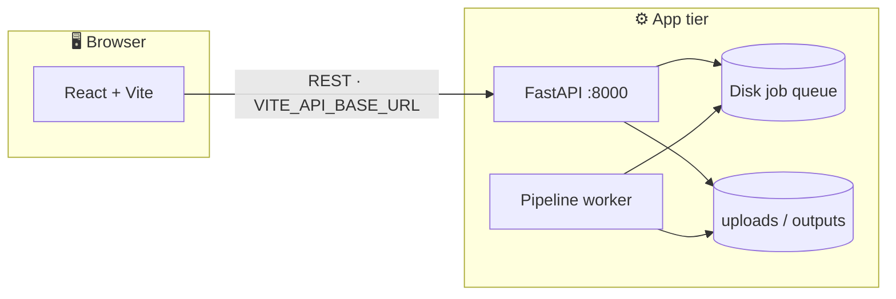

<div align="center">

<h1>🎙️ Voxinity</h1>

<p>
  <b>Video dubbing & translation</b> — monorepo with a modern web client and a FastAPI + ML pipeline.<br/>
  <sub>Upload · transcribe · translate · dub · export · optional sign-language flow</sub>
</p>

<p>
  <a href="https://vitejs.dev/"></a>
  <a href="https://react.dev/"></a>
  <a href="https://www.typescriptlang.org/"></a>
  <a href="https://tailwindcss.com/"></a>
</p>
<p>
  <a href="https://fastapi.tiangolo.com/"></a>
  <a href="https://www.python.org/"></a>
  <a href="https://www.docker.com/"></a>
  <a href="https://render.com/"></a>
  <a href="https://vercel.com/"></a>
</p>

<p>
  <a href="https://github.com/Ranuka-Jayesh/voxinity/stargazers"></a>
  <a href="https://github.com/Ranuka-Jayesh/voxinity/network/members"></a>
  
</p>

<p>
  <a href="https://github.com/Ranuka-Jayesh/voxinity"><b>Repository</b></a>
  &nbsp;·&nbsp;
  <a href="https://github.com/Ranuka-Jayesh/voxinity/issues"><b>Issues</b></a>
  &nbsp;·&nbsp;
  <a href="https://github.com/Ranuka-Jayesh/voxinity.git"><b>Clone</b></a>
</p>

<br/>

</div>

---

## Table of contents

| | |
|:--|:--|
| [Highlights](#highlights) | Stack at a glance |
| [Architecture](#architecture) | Mermaid diagram |
| [Quick start](#quick-start) | Install & 3-terminal run |
| [Environment](#environment) | `VITE_API_BASE_URL` & `CORS_ORIGINS` |
| [Deploy](#deploy) | Docker + Vercel |
| [Scripts](#scripts-reference) | `npm` commands |
| [GitHub About](#github-about-copy-paste) | Repo card copy-paste |
| [License](#license) | Add `LICENSE` when ready |

---

## Highlights

| | **Frontend** | **Backend & ML** |
|:--:|:--|:--|
| **Stack** | React 18 · Vite 5 · TypeScript · Tailwind · shadcn/ui · React Router | FastAPI · Uvicorn · disk job queue · FFmpeg |
| **Icons** |     |    |
| **Note** | Client uses `VITE_API_BASE_URL` or falls back to **`:8000`** on the same host. | Run **`npm run backend:pip`** beside the API so queued dub jobs execute. |

---

## Architecture



<p align="center"><sub>Rendered on GitHub. In production Docker, API + worker share one filesystem.</sub></p>

---

## Quick start

<details open>
<summary><b>📋 1 · Prerequisites</b></summary>

| | |
|:--|:--|
|  | **Node.js** 18+ |
|  | **Python** 3.11+ |
|  | **FFmpeg** on `PATH` (backend warns if missing) |

<br/>

</details>

<details>
<summary><b>📦 2 · Install</b></summary>

```bash
npm install
pip install -r backend/requirements.txt
```

</details>

<details>
<summary><b>🚀 3 · Run (three terminals)</b></summary>

| # | Role | Command | Port |
|:--:|--|--|:--:|
| **A** | 🎨 Frontend | `npm run dev` | **8080** |
| **B** | ⚡ API | `npm run backend:api` | **8000** |
| **C** | 🤖 ML worker | `npm run backend:pip` | — |

> **C** is required for dubbing when the API uses external pipeline mode (`backend.main_api`).

</details>

---

## Environment

| Variable | Set on | Purpose |
|:--|:--|:--|
| `VITE_API_BASE_URL` | Vite / **Vercel** | Public API base URL (no trailing slash). |
| `CORS_ORIGINS` | **Render** / Docker | Extra allowed browser origins, comma-separated. Localhost stays allowed in code. |

---

## Deploy

<details>
<summary><b>🐳 Backend — Docker (e.g. Render)</b></summary>

| File | Role |
|:--|:--|
| `Dockerfile.api` | Python + FFmpeg + `backend/` |
| `docker-entrypoint.sh` | **Uvicorn** + **`python -m backend.pipeline_worker`** (shared disk queue) |

1. **Render** → Web Service → **Docker** → `Dockerfile.api`
2. Set **`CORS_ORIGINS`** → e.g. `https://your-app.vercel.app`
3. Health check path: **`/health`**
4. Optional: import **`render.yaml`** as a blueprint, then set `CORS_ORIGINS` in the dashboard.

> ⏳ First build installs **PyTorch + TTS** — expect a **long** build and a **large** image. Upgrade RAM/CPU if jobs time out.

</details>

<details>
<summary><b>▲ Frontend — Vercel</b></summary>

1. New project → import this repo → **Vite** → `npm run build` → output **`dist`**
2. **`vercel.json`** handles SPA rewrites for React Router
3. Add **`VITE_API_BASE_URL`** → redeploy

</details>

<details>
<summary><b>🔗 Wire CORS</b></summary>

Set **`CORS_ORIGINS`** on the API to your **exact** Vercel origin (scheme + host, no path). Multiple sites: comma-separated list.

</details>

---

## Scripts reference

| Script | |
|:--|:--|
| `npm run dev` | Vite dev server |
| `npm run build` | Production build → `dist/` |
| `npm run preview` | Preview production build |
| `npm run backend:api` | FastAPI (`backend.main_api`) |
| `npm run backend:pip` | Dub / ML pipeline worker |

---

## GitHub About (copy-paste)

<details>
<summary><b>📌 Expand</b> — description & topics for the repo “About” card</summary>

**Description (≤350 chars):**

> Voxinity — video dubbing & translation: Vite + React + shadcn UI frontend, FastAPI + Uvicorn API, Whisper / XTTS-style pipeline worker. Monorepo with `npm run dev` + `npm run backend:api`.

**Topics:**  
`fastapi` `uvicorn` `vite` `react` `typescript` `tailwindcss` `shadcn-ui` `python` `video` `dubbing` `translation` `whisper` `monorepo`

</details>

---

## License

Add a **`LICENSE`** file when you choose terms (e.g. MIT).

---

<div align="center">

<br/>

**Maintainer** · [Ranuka Jayesh](https://github.com/Ranuka-Jayesh) · [voxinity](https://github.com/Ranuka-Jayesh/voxinity)

<sub>README tuned for GitHub — badges via <a href="https://shields.io">Shields.io</a> · diagram via Mermaid</sub>

</div>
